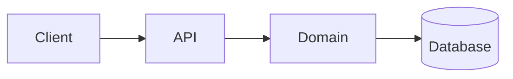

# Architecture overview

## Map

## Areas

The authoritative map of the codebase. Globs, not a directory tree — a tree goes stale
on every refactor, a glob survives one.

| Area | Glob | Responsibility | Must not |
| ---- | ---- | -------------- | -------- |
| <!-- e.g. HTTP layer --> | `<!-- src/api/** -->` | <!-- what it owns --> | <!-- what it must never do, e.g. "contain business rules" --> |

Every top-level source directory should appear in exactly one row. A directory absent
from this table is undocumented; a row whose glob matches nothing is stale.

## Entry points

Where execution actually begins. This is the first thing a newcomer or an agent looks for.

| Trigger | Entry point | Notes |
| ------- | ----------- | ----- |
| <!-- HTTP request --> | `<!-- src/server.ts -->` | <!-- port, middleware chain --> |
| <!-- CLI invocation --> | `<!-- src/cli/main.ts -->` | <!-- --> |
| <!-- Scheduled job --> | `<!-- --> ` | <!-- schedule, idempotency --> |

## Extension points

How to add the things this project adds most often. Each row should let someone make
a correct change without reading the whole codebase.

| To add a… | Touch | Then |
| --------- | ----- | ---- |
| <!-- e.g. new API endpoint --> | <!-- files, in order --> | <!-- register it here, add a test there --> |
| <!-- e.g. new database table --> | <!-- --> | <!-- migration + model + fixture --> |

## Invariants

Rules the architecture depends on. Breaking one is not a refactor — it needs an ADR.

- <!-- e.g. The domain layer imports nothing from the HTTP layer -->
- <!-- e.g. All external calls go through a single client module with retry and timeout -->
- <!-- e.g. No business logic in database triggers -->

Where an invariant is enforced automatically (lint rule, dependency-cruiser, test),
name the enforcement — an unenforced invariant is a wish.

## Boundaries and dependencies

| Depends on | Why | Escape hatch if it disappears |
| ---------- | --- | ----------------------------- |
| <!-- external service or major library --> | <!-- --> | <!-- ADR link or "none — accepted lock-in" --> |

## What this system does not do

Deliberate non-capabilities, so nobody re-implements them by accident.

- <!-- e.g. Does not store payment card data — handled entirely by the provider -->

## Deeper detail

- Why it is like this: [../decisions/README.md](../decisions/README.md)

<!-- Uncomment each line when the optional document is created:
- Persistence and contracts: [DATA-MODEL.md](./DATA-MODEL.md)
- Access, isolation, secrets: [THREAT-MODEL.md](./THREAT-MODEL.md)
-->

## Verifying this document

`covers` above declares which code this document describes. When that code changes,
the checker flags this file as presumed stale. Re-read it against the code, then either
fix it or bump `last_verified` and set `status: verified`.
