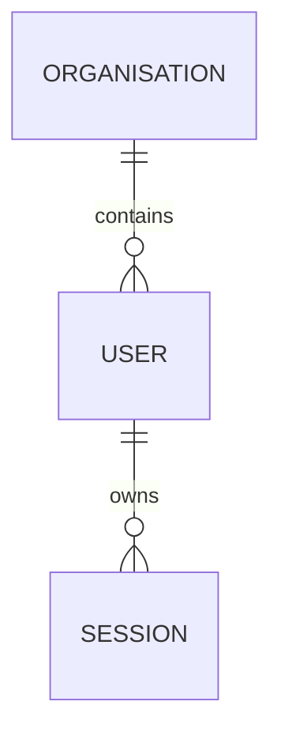

# Data model

> Optional document — create it only when the schema is large enough that reading it
> is slower than reading a summary. Never restate what a generated schema file already
> says; document the parts a schema cannot express.

## Entities

## What the schema cannot say

The valuable half of this document. One row per rule that is enforced in code,
convention, or nowhere at all.

| Rule                                                                | Enforced where                          | Consequence if violated |
| ------------------------------------------------------------------- | --------------------------------------- | ----------------------- |
| <!-- e.g. `status` only moves forward through the state machine --> | <!-- code / db constraint / nothing --> | <!-- -->                |

## Ownership and lifecycle

| Entity   | Created by | Deleted when                   | Retention                            |
| -------- | ---------- | ------------------------------ | ------------------------------------ |
| <!-- --> | <!-- -->   | <!-- cascade? soft delete? --> | <!-- legal or product constraint --> |

Soft-delete, cascade, and anonymisation rules belong here — they are the source of
most production surprises.

## External contracts

Interfaces other people depend on. Changing these is a breaking change.

| Contract               | Definition                 | Consumers    | Versioning      |
| ---------------------- | -------------------------- | ------------ | --------------- |
| <!-- e.g. REST /v1 --> | <!-- openapi.yaml path --> | <!-- who --> | <!-- policy --> |

## Migrations

- Tooling: <!-- PROJECT: migration-tool -->
- How to create one: [DEVELOPMENT.md](./DEVELOPMENT.md)
- Irreversible migrations: <!-- policy — are they allowed, and how are they reviewed? -->
