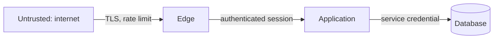

# Threat model

> This is the **internal security design** — how the system defends itself. It is not the
> public vulnerability disclosure policy (how outsiders report a flaw), which belongs in a
> root `SECURITY.md` owned separately. Do not merge the two: different audiences, different
> lifecycles.

> Optional document — create it once the project has authentication, multi-tenancy,
> or handles data whose exposure would matter.

## Trust boundaries

For each arrow: what is validated, and what is assumed. Assumptions are where breaches live.

## Authentication and authorization

| Question                                   | Answer                                       |
| ------------------------------------------ | -------------------------------------------- |
| How is identity established?               | <!-- provider, token type, lifetime -->      |
| Where is the authorization check enforced? | <!-- single choke point, or per-handler? --> |
| What happens on failure?                   | <!-- deny by default? -->                    |

## Access matrix

Mirrors the roles in [PRODUCT.md](./PRODUCT.md), at the resource level.

| Role     | Resource | Read | Write | Delete |
| -------- | -------- | ---- | ----- | ------ |
| <!-- --> | <!-- --> |      |       |        |

## Isolation

- Tenant scoping enforced at: <!-- query layer? row-level security? middleware? -->
- What a missing scope filter would expose: <!-- be concrete -->
- Test that would catch it: <!-- name it, or record that none exists -->

## Secrets

| Secret   | Stored in                      | Rotated          | Who can read it |
| -------- | ------------------------------ | ---------------- | --------------- |
| <!-- --> | <!-- manager, not the repo --> | <!-- cadence --> | <!-- -->        |

Never commit secrets. If one is committed, rotate it immediately and treat history
rewrite as optional cleanup — a rotation runbook in `RUNBOOKS.md` belongs there when
that on-demand file exists.

## Known accepted risks

Risks the team decided to live with, with the reasoning. An accepted risk is a decision:
link the entry in [DECISIONS.md](./DECISIONS.md).

| Risk     | Why accepted | ADR      | Revisit if |
| -------- | ------------ | -------- | ---------- |
| <!-- --> | <!-- -->     | <!-- --> | <!-- -->   |
